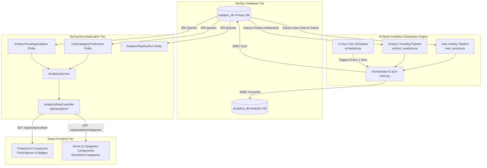

# 🚀 BuildPro PySpark Analytics Subsystem Integration & Architecture

This document provides a comprehensive overview of the end-to-end data analytics pipeline, PySpark offline processing engine, MySQL `analytics_db` persistence layer, Hibernate JPA ORM integration, Spring Boot REST APIs, and React frontend personalization feeds for **BuildPro E-Commerce Subsystem**.

---

## 📐 System Architecture Overview



---

## 🗄️ 1. Database Schema & Persistence Setup

### Dedicated Analytics Database (`analytics_db`)
The system creates `analytics_db` automatically if not present via MySQL JDBC connection parameters:
```properties
jdbc:mysql://localhost:3306/analytics_db?createDatabaseIfNotExist=true&allowPublicKeyRetrieval=true&useSSL=false
```

### Table Definitions

#### `user_category_preferences`
Stores active user preferred categories derived from cart & order volume.
```sql
CREATE TABLE IF NOT EXISTS user_category_preferences (
    user_id BIGINT PRIMARY KEY,
    user_name VARCHAR(255),
    category_id BIGINT NOT NULL,
    category_name VARCHAR(255),
    total_quantity BIGINT NOT NULL,
    calculated_at TIMESTAMP DEFAULT CURRENT_TIMESTAMP
);
```

#### `product_trending_analytics`
Stores top trending products ranked by cart additions and order demand.
```sql
CREATE TABLE IF NOT EXISTS product_trending_analytics (
    product_id BIGINT PRIMARY KEY,
    product_name VARCHAR(255),
    cart_count BIGINT NOT NULL,
    rank_order INT NOT NULL,
    calculated_at TIMESTAMP DEFAULT CURRENT_TIMESTAMP
);
```

#### `analytics_pipeline_runs`
Maintains execution audit logs for every PySpark batch run.
```sql
CREATE TABLE IF NOT EXISTS analytics_pipeline_runs (
    pipeline_name VARCHAR(255) PRIMARY KEY,
    status VARCHAR(50) NOT NULL,
    records_processed BIGINT,
    start_time TIMESTAMP,
    end_time TIMESTAMP,
    error_message TEXT
);
```

---

## ⚡ 2. PySpark Data Processing Subsystem

### Core Scripts (`Model/`)
- `Model/config/db_connection.py`: Manages PySpark `SparkSession` instantiation, sets `PYSPARK_PYTHON = sys.executable` for Windows worker execution safety, and provides multi-DB JDBC persistence (`analytics_db` and `buildpro_db`).
- `Model/analytics/user_activity.py`: Calculates highest volume categories per user using PySpark Window functions (`ROW_NUMBER() OVER (PARTITION BY user_id ORDER BY total_quantity DESC)`).
- `Model/analytics/product_analysis.py`: Ranks products by cart popularity using Window ranking (`DENSE_RANK() OVER (ORDER BY cart_count DESC)`).
- `Model/main.py`: Batch orchestrator executing all analytics jobs and recording execution telemetry in `analytics_pipeline_runs`.
- `Model/scheduler.py`: Recurring job runner running `main.py` every **1 hour** (3,600 seconds).

---

## ☕ 3. Spring Boot Subsystem Integration

### Hibernate JPA Entities
- `UserCategoryPreference.java`: Maps `user_category_preferences`.
- `ProductTrendingAnalytics.java`: Maps `product_trending_analytics`.
- `AnalyticsPipelineRun.java`: Maps `analytics_pipeline_runs`.

### JPA Repositories
- `UserCategoryPreferenceRepository.java`: `findFirstByUserIdOrderByCalculatedAtDesc(Long userId)`
- `ProductTrendingAnalyticsRepository.java`: `findAllByOrderByRankOrderAsc()`
- `AnalyticsPipelineRunRepository.java`: `findAll()`

### Personalization Logic (`AnalyticsService.java`)
- **New / Guest Users**: Sorts feed by `product_trending_analytics.rank_order`.
- **Active Returning Users**: Identifies user's top preferred category, boosts all products matching that category to **Positions #1–#5** at the top of the feed, and reorders remaining items by popularity rank.
- **Category Reordering**: Moves user's preferred category to **Position #1** in category listings.

### REST API Endpoints (`AnalyticsRestController.java`)
- `GET /api/analytics/feed?userId={id}`: Returns personalized product feed payload with `isNewUser`, `feedType`, `preferredCategory`, and DTO products.
- `GET /api/analytics/categories?userId={id}`: Returns category feed with user's top preferred category at position #1.
- `GET /api/analytics/user-preference?userId={id}`: Returns category preference details.

---

## ⚛️ 4. React Frontend Integration

### Personalization Feed Component (`ProductList.jsx`)
Fetches `/api/analytics/feed?userId={currentUserId}`:
- **Active User Mode**: Displays **"🎯 Recommended for You"** banner and adds **`🎯 Preferred`** badge to category matched items.
- **New User / Guest Mode**: Displays **"🔥 Popular & Trending Feed"** banner.

### Category Reordering (`Home.jsx` & `Categories.jsx`)
Fetches `/api/analytics/categories?userId={currentUserId}` and renders categories in personalized order.

---

## 🛠️ How to Run the Complete Solution

### 1. Execute PySpark Analytics Pipeline (Manual Run)
```bash
python Model/main.py
```

### 2. Start Automated 1-Hour Analytics Scheduler
```bash
python Model/scheduler.py
```

### 3. Build & Run Spring Boot Backend
```bash
mvn clean compile
mvn spring-boot:run
```

### 4. Run React Frontend
```bash
cd frontend
npm run dev
```

---

## ✅ Integration Verification Metrics

| Endpoint | Test Context | Expected Output | Status |
| :--- | :--- | :--- | :--- |
| `GET /api/analytics/feed?userId=54` | Active User (Mohankanth) | `isNewUser: false`, `preferredCategory: "Cement"`, Cement items boosted to #1–#5 | **VERIFIED (200 OK)** |
| `GET /api/analytics/feed` | Guest / New User | `isNewUser: true`, `feedType: "TRENDING_PRODUCTS"` | **VERIFIED (200 OK)** |
| `GET /api/analytics/categories?userId=54` | Active User | `Position #1: Cement` | **VERIFIED (200 OK)** |
