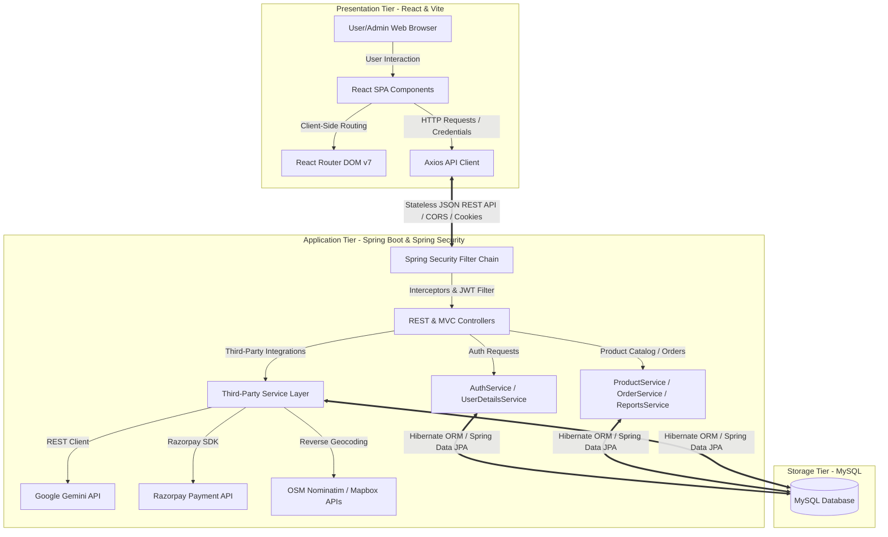
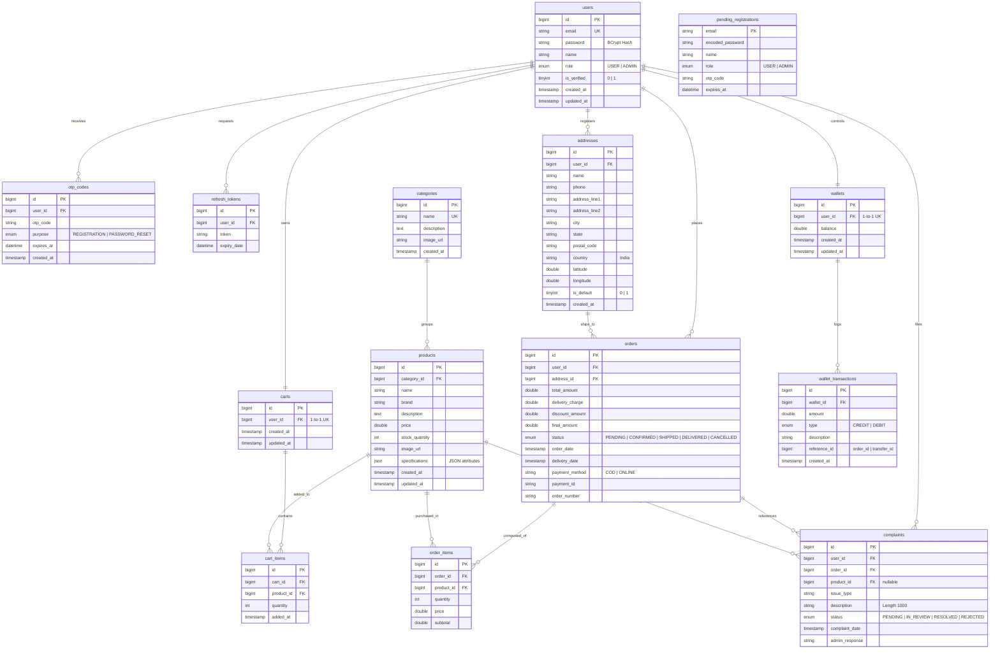
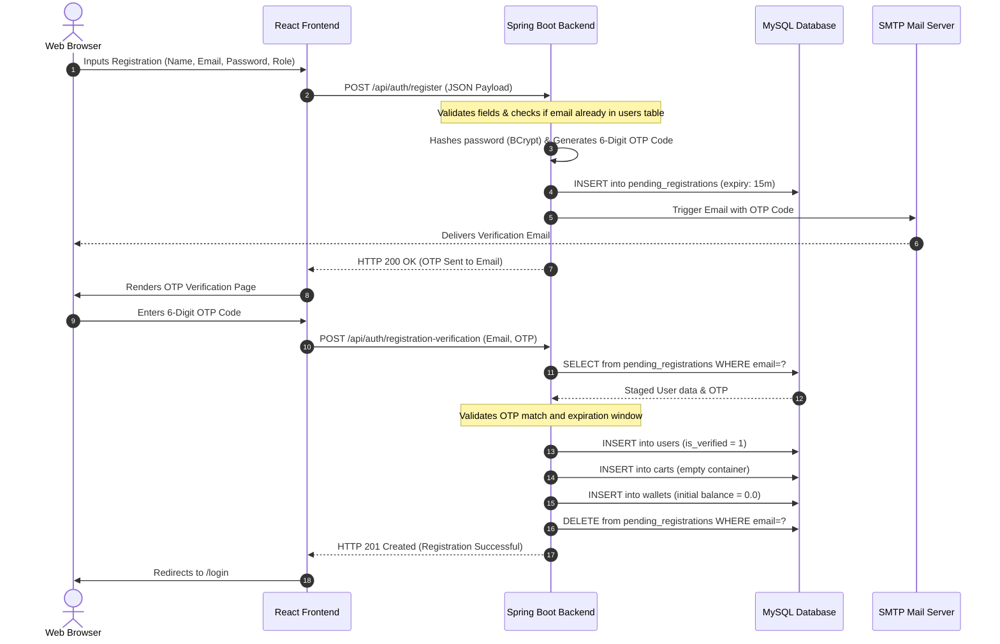
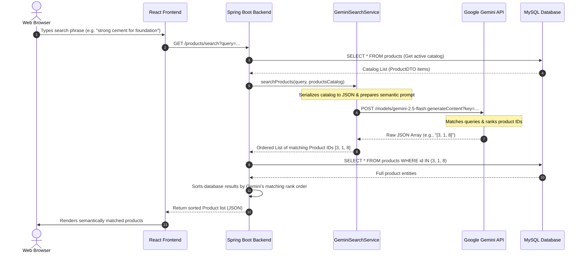
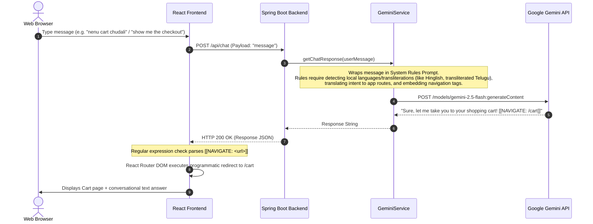
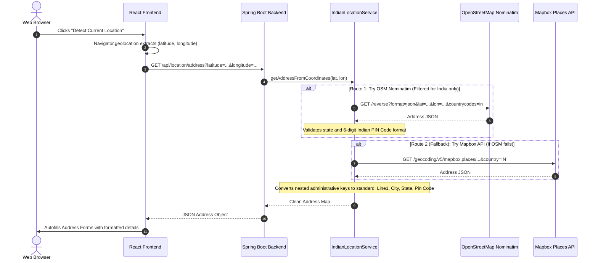
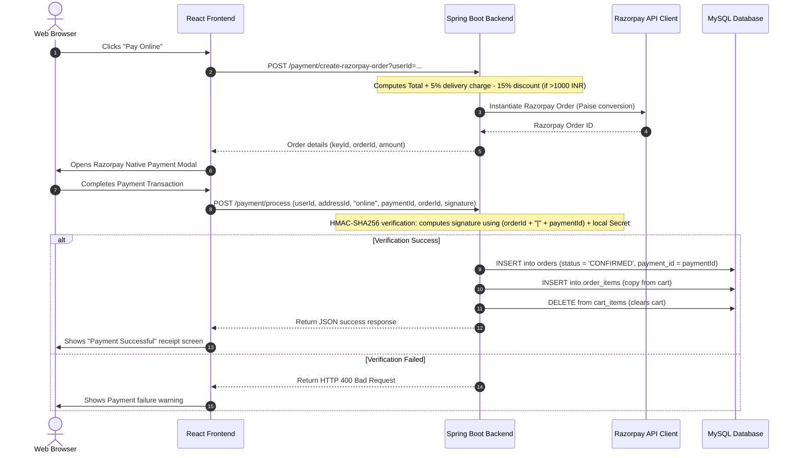

# System Design & Architecture: BuildPro Construction Materials E-Commerce Application

This document outlines the architecture, database schema, component design, core workflows, and key technical design decisions for **BuildPro**—a full-stack e-commerce marketplace dedicated to buying and selling construction materials.

---

## 1. High-Level Architecture

BuildPro is built upon a modern, distributed **Three-Tier Architecture** consisting of a single-page React frontend, a RESTful Spring Boot backend, and a relational MySQL database, augmented with intelligent cloud integrations (Google Gemini AI, Razorpay Payment Gateway, Mapbox & OpenStreetMap Geocoding).



---

## 2. Directory Structure & Component Design

The project is structured to separate concerns between frontend logic and backend services.

```text
E-commerce-Website-for-Construction-Materials-Java-Full-Stack-Web-Application/
├── pom.xml                                 # Maven backend dependency and build configuration
├── .env                                    # Centralized backend environment secrets
├── README.md                               # Project quickstart & deployment guide
├── README_SYSTEM_DESIGN.md                 # System architecture & database schema (This file)
├── src/                                    # Spring Boot Backend Source Code
│   └── main/
│       ├── java/com/example/buildpro/
│       │   ├── config/                     # Spring Security, Web MVC CORS, and JWT configurations
│       │   ├── controller/                 # REST & MVC controllers handling client endpoints
│       │   ├── dto/                        # Data Transfer Objects decoupled from JPA entities
│       │   ├── exception/                  # Global exceptions and custom error handlers
│       │   ├── model/                      # JPA Database Entities (User, Product, Order, etc.)
│       │   ├── repository/                 # Spring Data JPA data access interfaces
│       │   ├── service/                    # Business services and AI/Payment/Geolocation integrations
│       │   └── util/                       # Cryptographic, JWT token, and math utilities
│       └── resources/
│           ├── templates/                  # Thymeleaf HTML files for MVC/Admin views
│           └── application.properties       # Core Spring Boot properties loader
│
└── frontend/                               # React + Vite Frontend Codebase
    ├── package.json                        # Frontend dependencies (React 19, Axios, Tailwind CSS v4)
    ├── vite.config.js                      # Vite server configs and API dev proxies
    ├── src/
    │   ├── main.jsx                        # Entry point setting up base Axios routes and globals
    │   ├── App.jsx                         # App layout, global State Contexts, and routing table
    │   ├── index.css                       # Global styles and Tailwind utility injections
    │   ├── context/                        # Context API for user authentication and state
    │   ├── utils/                          # Frontend helpers and Axios wrapper configurations
    │   └── components/                     # Component modules
    │       ├── admin/                      # Admin-specific modules (Dashboard, lists, forms)
    │       ├── common/                     # Shared UI components (Navbar, Footer, Modals)
    │       └── [ViewName].jsx              # View components (Cart, Checkout, Home, ProductDetail, etc.)
```

---

## 3. Database Schema & Entity-Relationship Diagram (ERD)

BuildPro stores all operational data in a MySQL database. Database entities are mapped through Hibernate ORM. Relational integrity is enforced using foreign keys, cascading configurations, and custom index constraints.



---

## 4. Key Workflows & System Workings

### 4.1. Double-Opt-In User Registration & OTP Validation
To ensure high-quality user credentials, self-registration employs a temporary staging phase prior to database persistence.



### 4.2. Intelligent Semantic Product Search (Gemini API Integration)
BuildPro utilizes natural language models to process search requests, making search results highly semantic and tolerant of phrasing variations.



### 4.3. Interactive AI Shop Assistant (Gemini Navigation Chatbot)
The assistant helps users find products, navigate pages, and resolve queries by acting on navigation directives.



### 4.4. Accurate Indian Reverse Geocoding Integration
BuildPro provides a location-detection button that reverse-geocodes GPS coordinates into formatted Indian addresses.



### 4.5. Cart Checkout & Razorpay Payment Lifecycle
Supports cash-on-delivery (COD) and secure payment validation using signature checks.



---

## 5. Architectural Design Patterns & Principles

### 5.1. Stateless JWT Token Authentication
The system uses **Spring Security** combined with a custom filter to handle JSON Web Tokens (JWT) in a stateless setup, which eliminates the need for HTTP sessions.
- **`JwtAuthenticationFilter.java`**: Extracts the bearer token from incoming HTTP authorization headers (or HTTP-only cookies), validates the token signature, checks expiration, parses user details, and sets the Security context.
- **Stateless Session Policy**: Configured in `SecurityConfig.java` to prevent session creation on the server:
  `SessionCreationPolicy.STATELESS`.
- **CORS Policies**: Explicitly defined to permit credentials (`allowCredentials(true)`) for production and local environments (`http://localhost:5173`) while preventing duplicate origin errors.

### 5.2. Separation of Concerns (SoC) via Controllers and DTOs
- Database models (JPA `@Entity` classes) are decoupled from network transfer payloads to prevent performance issues (like infinite recursion in Hibernate relationships) and ensure data security.
- Data Transfer Objects (DTOs), such as `ProductDTO.java` and `OrderDTO.java`, carry structured fields between API endpoints.
- Thymeleaf controllers (handling administrative views under `/admin/**`) and RESTful Controllers (`/api/**`) are separated to partition web routing from client JSON endpoints.

### 5.3. Defensive Transactional Wallet Management
The application implements internal wallet features (`Wallet.java`) to log credit/debit transaction records (`WalletTransaction.java`). Wallet updates are marked as transactional (`@Transactional`) to prevent balance drift during checkout or refunds.

### 5.4. Geocoding Resiliency Pattern
The `IndianLocationService.java` reverse-geocodes locations through a cascading backup pattern:
$$\text{OSM Nominatim} \longrightarrow \text{Here Maps} \longrightarrow \text{Mapbox API} \longrightarrow \text{Google Geocoding} \longrightarrow \text{Internal Geolocation Fallback}$$
This sequence ensures reliability even if third-party APIs encounter outages or quota limits.

---

## 6. Recommendations for Scaling & Deployment

### 6.1. Containerization (Docker Architecture Setup)
To deploy BuildPro consistently, containerize the application using the following Docker setup:

```yaml
version: '3.8'

services:
  database:
    image: mysql:8.0
    container_name: buildpro-db
    restart: always
    environment:
      MYSQL_DATABASE: buildpro_db
      MYSQL_ROOT_PASSWORD: root_production_password
    ports:
      - "3306:3306"
    volumes:
      - db_data:/var/lib/mysql

  backend:
    build:
      context: .
      dockerfile: Dockerfile
    container_name: buildpro-backend
    restart: always
    ports:
      - "8081:8081"
    environment:
      - DB_URL=jdbc:mysql://database:3306/buildpro_db?useSSL=false&allowPublicKeyRetrieval=true
      - DB_USERNAME=root
      - DB_PASSWORD=root_production_password
    depends_on:
      - database

  frontend:
    build:
      context: ./frontend
      dockerfile: Dockerfile
    container_name: buildpro-frontend
    restart: always
    ports:
      - "80:80"
    depends_on:
      - backend

volumes:
  db_data:
```

### 6.2. Production Scaling Improvements
1. **Flyway/Liquibase Migrations**: Replace automatic Hibernate schema updates (`spring.jpa.hibernate.ddl-auto=update`) with tool-managed migrations like Flyway to track database changes safely in production.
2. **Distributed Cache (Redis)**: Cache slow operations, such as Gemini semantic searches and product catalog lookups, in a Redis instance to reduce external API costs and database read volume.
3. **Connection Pooling**: Tweak HikariCP database pool parameters (`maximum-pool-size`, `minimum-idle`) in `application.properties` to handle increased backend transaction volumes.
4. **Nginx Reverse Proxy & SSL**: Deploy Nginx as a reverse proxy in front of the frontend containers to terminate SSL, compress assets (gzip/brotli), and handle load balancing.
